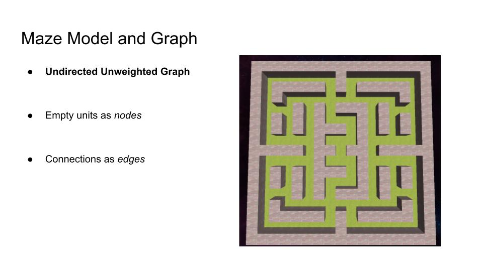
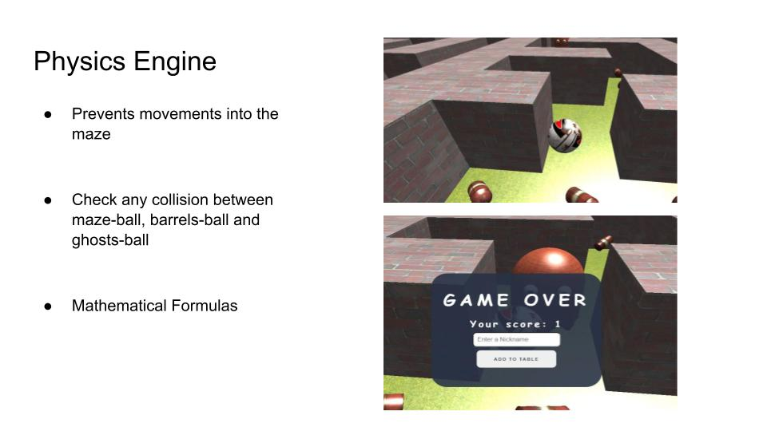
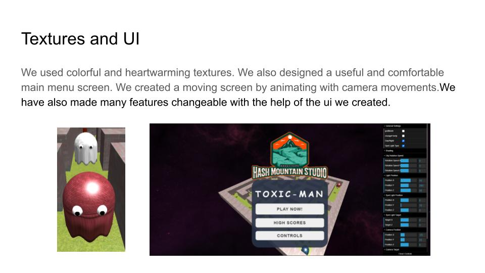

# Toxic-Man ®

Toxic-Man is a term project of **BBM412 Computer Graphics** course of *Computer Engineering Department at Hacettepe University*.

This term project theme was Environmental Issues, therefore we aimed to remake 3D version of **Pacman**, switched Toxic-Man to raise an awareness for **chemical pollution**. The game consists of **physics-engine**, different types of **shadings and lightnings**, textures, **power-ups** such as speed-up and hammer, **intelligent ghosts**, and GUI for game settings.

### Execution

*Chrome is recommended for the best game experience.*

```bash
http-server -o --cors
```

### Tech Stack

* WebGL2
* HTML5
* Javascript
* Three.js


### Trailer

https://youtu.be/YlF5vE6nfBQ


## Project Presentation










